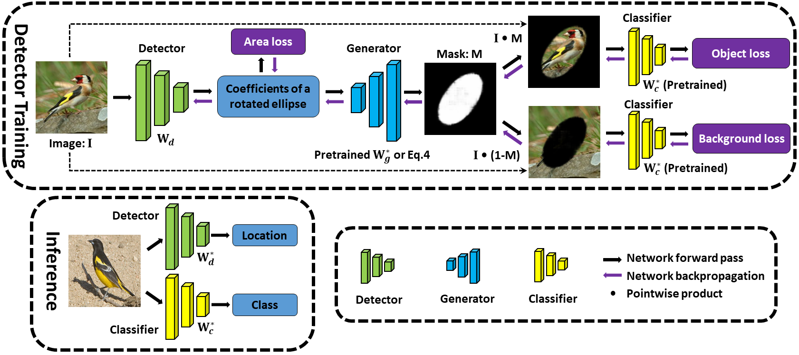
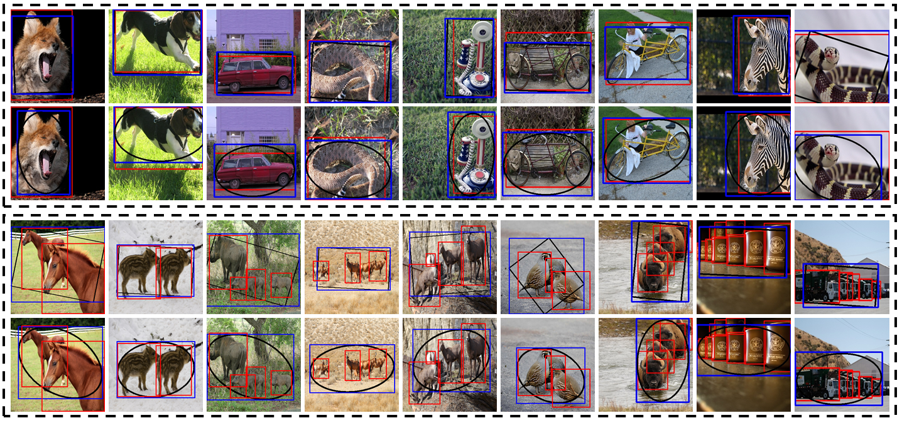
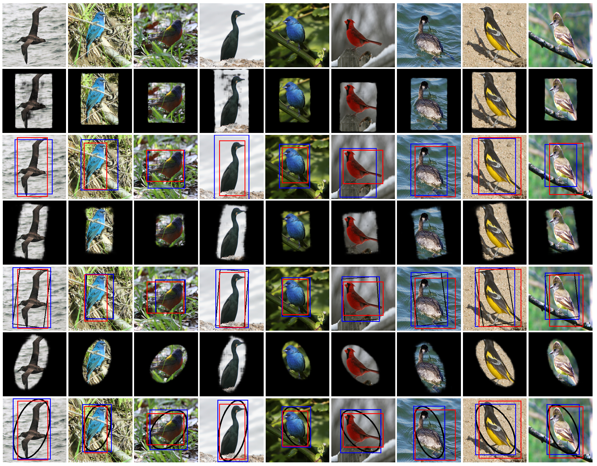

# GC-Net
Weizeng Lu, Xi Jia, Weicheng Xie, Linlin Shen, Yicong Zhou, and Jinming Duan: Geometry Constrained Weakly Supervised Object Localization, In the European Conference on Computer Vision (ECCV) 2020
## Overview of GC-Net
We propose a geometry constrained network, termed GC-Net, for weakly supervised object localization (WSOL). GC-Net consists of three modules: a detector, a generator and a classifier. The detector predicts the object location represented by a set of coefficients describing a geometric shape (i.e. ellipse or rectangle), which is geometrically constrained by the mask produced by the generator. The classifier takes the resulting masked images as input and performs two complementary classification tasks (object and background). To make the mask more compact and more complete, we propose a novel multi-task loss function that takes into account area of the geometric shape, the categorical crossentropy and the negative entropy. In contrast to previous approaches, GC-Net is trained end-to-end and predict object location without any post-processing (e.g. thresholding) that may require additional tuning. Extensive experiments on the CUB-200-2011 and ILSVRC2012 datasets show that GC-Net outperforms state-of-the-art methods by a large margin.

## Setup
1. Clone this repo:
~~~
git clone git@github.com:lwzeng/Geometry-Constrained-Weakly-Supervised-Object-Localization.git
~~~
2. Create an Anaconda environment:
~~~
python==3.6
PyTorch==1.1.0
~~~
3. Download the images of CUB-200-2011 dataset and modify the data path in the 
## Training
~~~
cd detector
python detector.py
~~~
## Evaluation
cub200:
~~~
cd detector
python detector.py 
~~~
imagenet:
~~~
cd detector
python test_imagenet.py
~~~
## Visualization
Localization results on some images from the ILSRC2012 dataset using GC-Net

Localization results of examples from CUB-200-2011 dataset using GC-Net

